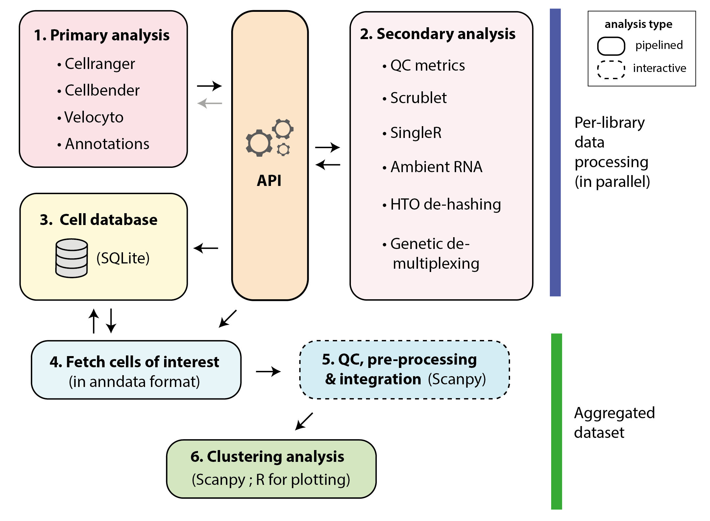

# cellhub

A scaleable workflow for the analysis of single cell datasets using compute clusters.

## Workflow overview

## Documentation

For installation and usage please see the [cellhub docs](https://cellhub.readthedocs.io/)

## Status

This is alpha (pre-release) software.
