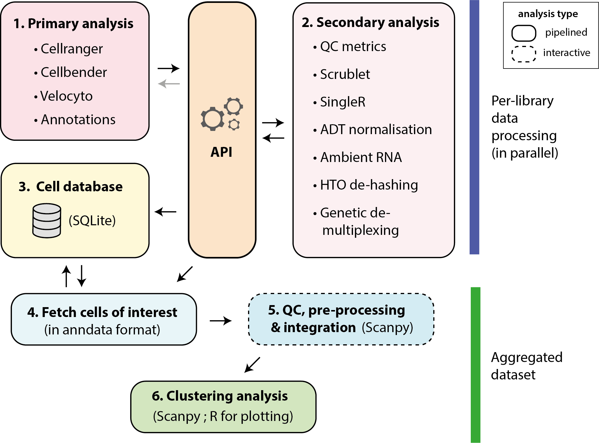

Workflow Overview
=================

Introduction
------------

Cellhub is designed to efficiently parallelise the processing of large 10x datasets on compute clusters. Data for each of the sequencing libraries in the experiment is quantitated and quality controlled in parallel. Sample metadata, qc statistics and other per-cell information are stored in an SQL database. This information can be easily retrieved from a virtual table in the database for QC analysis. Data for arbitrary sets of cells of interest (specified using an SQL query) can be automatically and rapidly extracted in anndata format for downstream analysis.

By design, in the cellhub workflow, cell QC assessment, pre-processing and integration are performed interactively by the user. Often, different approaches to these steps are appropriate for different datasets and the user is directed to e.g. `Luecken et al. 'Current best practices in single-cell RNA-seq analysis: a tutorial'<https://doi.org/10.15252/msb.20188746>` and `Lueken et al. 'Benchmarking atlas-level data integration in single-cell genomics'<https://doi.org/10.1038/s41592-021-01336-8>` to get a feel for the issues.

Once the data has been integrated, the cellhub clustering pipeline can be used to execute detailed cell clustering analysis for a selection of resolutions. This pipeline will identify marker genes, perform pathway analysis and export pdf reports and a cellxgene object for inspection. 

As shown in the image above, the workflow can be divided into six parts. Interoperability between the pipelines is enabled by a structured API, which facilities processing of complex experiment designs (including genetic/hash tag demultiplexing), correction of ambient RNA and easy addition of new workflows.

1. Primary analysis
-------------------

These pipelines process the raw data to generate count matrices or fetch annotations from externals sources. They register their outputs on the API.

- The workflow typically begins with :doc:`pipeline_cellranger.py<pipelines/pipeline_cellranger>`. The pipeline maps reads from the different libraries in parallel using "cellranger count" and "cellranger vdj" commands.

- CellBender can be run to correct ambient RNA with :doc:`pipeline_cellbender.py<pipelines/pipeline_cellbender>`. Typically, this pipeline will be run in a separate directory so that the downstream results can be compared with those from the uncorrected cellranger run.

- Velocyto can be run to compute spliced and unspliced counts for RNA-velocity analysis with :doc:`pipeline_velocyto.py<pipelines/pipeline_velocyto>`.

- Cell identification can be performed with :doc:`pipeline_emptydrops.py<pipelines/pipeline_emptydrops>` for comparison with the Cellranger calls. Currently results are not available for use downstream.

2. Secondary analysis
---------------------

These pipelines start from the outputs of the primary analysis pipelines on the API.

- Per-cell QC statistics are computed in parallel for each channel library using :doc:`pipeline_cell_qc.py<pipelines/pipeline_cell_qc>`. The pipeline computes various statistics including standard metrics such as percentage of mitochondrial reads, numbers of UMIs and numbers of genes per cell. In addition it can compute scores for custom genesets. The pipeline also runs the Scrublet algorithm for doublet prediction.

- Per-cell celltype predictions are computed in parallel for each channel library using :doc:`pipeline_singleR.py<pipelines/pipeline_singleR>`

- The per-library patterns of ambient RNA can be inspected using :doc:`pipeline_ambient_rna.py<pipelines/pipeline_ambient_rna>`.

- Cells multiplexed with hash-tags can be de-hashed using :doc:`pipeline_dehash.py<pipelines/pipeline_dehash>`

- If samples included the ADT modality, :doc:`pipeline_adt_norm.py<pipelines/pipeline_adt_norm>` normalizes the antibody counts for the high-quality fetched cells in the previous step. Normalized ADT can be then used for downstream integration. The pipeline implements 3 normalization methodologies: DSB, median-based, and CLR. The user can specify the feature space.

3. Loading results into the cell database
-----------------------------------------

The library and sample metadata, per cell statistics (and demultiplex assignments) etc, are loaded into an sqlite database using :doc:`pipeline_celldb.py<pipelines/pipeline_celldb>`. The pipeline creates a view called "final" which contains the qc and metadata needed for cell selection and downstream analysis.

.. note:: The user is required to supply a tab-separated sample metadata file (e.g. "samples.tsv") via a path in the pipeline_celldb.yml configuration file. It should have columns for library_id, sample_id as well as any other relevant experimental metadata such as condition, genotype, age, replicate, sex etc.

4. Fetching of cells for downstream analysis
--------------------------------------------

Cells are fetched using :doc:`pipeline_fetch_cells.py<pipelines/pipeline_fetch_cells>`. The user specifies the cells that they wish to retrieve from the "final" table (see step 4) via an SQL statement in the pipeline_fetch_cells.yml configuration file. The pipeline will extract the cells and metadata from the original matrices and combine them into an anndata object for downstream analysis.

It is recommended to fetch cells into a new directory. By design fetching of a single dataset per-directory is supported.

The pipeline supports fetching of Velocyto results for RNA-velocity analysis.

.. note:: The retrieved metadata will include a "sample_id" column. From this point onwards it may be natural to think of the "sample_id" as the unit of interest. The "library_ids" remain in the metadata along with all the qc statistics to facilitate downstream investigation of batch effects and cell quality.

5.  Assessment of cell quality, pre-processing and integration
--------------------------------------------------------------

These steps are performed manually. 

- Per cell QC statistics and singleR scores can be easily retrieved from the celldb or anndata object for inspection with R or python.

- It is recommended to perform pre-processing using Scanpy. Strategies for HVG selection and modelling of covariates should be considered by the data analyst on a case by case basis.

- Integration is normally performed in python with e.g. scVI, harmonpy or BBKNN. Different integration algorithms are needed for different contexts.

6. Clustering analysis
-----------------------

Clustering analysis is performed with pipeline_cluster.py. The pipeline starts from an anndata provided by the user in the format described in the pipeline documentation: :doc:`pipeline_cluster<pipelines/pipeline_cluster>`.

