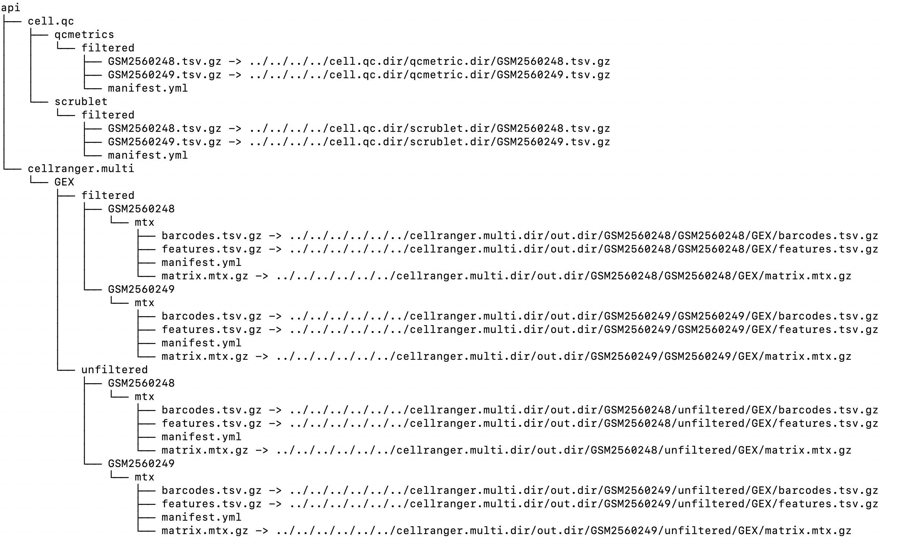

API
===

Overview
--------

The primary and secondary analysis pipelines must define and register their outputs via a common api. The :doc:`cellhub.tasks.api module<tasks/api>` provides the code for doing this. The api comprises of an "api" folder into which pipeline outputs are symlinked (by the "register_dataset" "api" class method).

The api provides a standardised interface from which the downstream pipelines can access the information.

Example
-------

The "api" folder for the IFNB example dataset looks like this.

Usage
-----

Please see the :doc:`cellhub.tasks.api module documentation<tasks/api>` for more details.

..note:: If you are writing a pipeline and information that you need from an upstream pipeline has not been exposed on the api please raise an issue.
