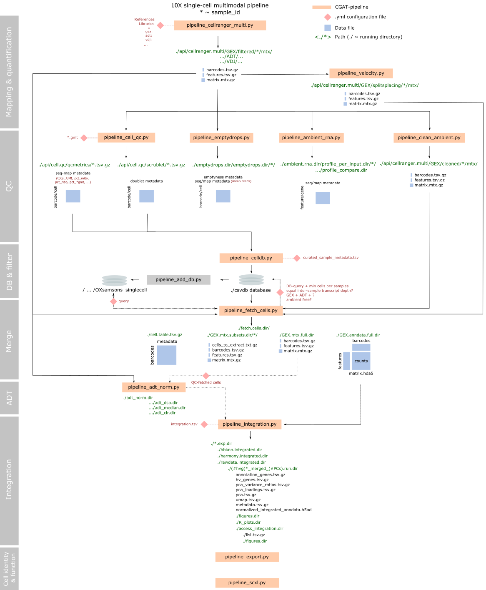

Workflow Overview
=================

Philosophy
----------

Cellhub is designed to efficiently parallelise the processing of large datasets. Once processed different data slices can be easily extracted directly from the original matrices, aligned and exported for downstream analysis. At the heart of operations is an sqlite database which warehouses the experiment metadata and per-cell statistics.

The workflow can be divided into seven main steps.

1. Quantitation of per-channel libraries
----------------------------------------

The workflow begins with :doc:`pipeline_cellranger_multi.py<pipelines/pipeline_cellranger_multi>`. Input 10X capture channel library identifiers "library_id" and their associated fastq files are specified in the pipeline_cellranger_multi.yml configuration file. The reads from the different libraries will be mapped in parallel.

.. note:: The channel library is considered to be the fundamental "batch" unit of a 10X experiment. Cells captured from the same channel are exposed to the same ambient RNA. Separate genomic libraries are prepared for each 10x channel.

- It is recommend to inspect patterns of ambient RNA using :doc:`pipeline_ambient_rna.py<pipelines/pipeline_ambient_rna>`.

- Per-channel velocity matrices can be prepared using :doc:`pipeline_velocity.py<pipelines/pipeline_velocity>`.

- Cell identification can also be performed with :doc:`pipeline_emptydrops.py<pipelines/pipeline_emptydrops>`.

2. Computation of per-cell statistics
-------------------------------------

Per-cell statistics are computed in parallel for each channel library using :doc:`pipeline_cell_qc.py<pipelines/pipeline_cell_qc>`. The pipeline computes various statistics including standard metrics such as percentage of mitochondrial reads, numbers of UMIs and numbers of genes per cell. In addition it can compute scores for custom genesets.

.. note:: all per-channel matrices containing computed cell statistics are required to contain "library_id" and "barcode_id" columns. The "barcode_id" column must have the structure "umi_code-1-library_id" (e.g. AAAAAAAAAA-1-GSM0001).

.. note:: file names of the per-channel matrices are specified as "library_id.tsv.gz" (matrices for different analyses such as e.g. qcmetrics and scrublet scores are written to separate folders).

3. Cell demultiplexing [optional]
---------------------------------

If samples have been multiplexed within channels either genetically or using hash tags a table of barcode_id -> sample_id assignments are prepared using pipeline_demux.py [not yet written].

4. Preparation of the cell database
-----------------------------------

The library and sample metadata, per cell statistics (and demultiplex assignments) are loaded into an sqlite database using :doc:`pipeline_celldb.py<pipelines/pipeline_celldb>`. The pipeline creates a view called "final" which contains the qc and metadata needed for cell selection and downstream analysis.

.. note:: The user is required to supply a tab-separated sample metadata file via a path in the pipeline_celldb.yml configuration file. It should have columns for library_id, sample_id as well as any other relevant experimental metadata such as condition, genotype, age, replicate, sex etc.

5. Fetching of cells for downstream analysis
--------------------------------------------

Cells are fetched using :doc:`pipeline_fetch_cells.py<pipelines/pipeline_fetch_cells>`. The user specifies the cells that they wish to retrieve from the "final" table (see step 4) via an sql statement in the pipeline_fetch_cells.yml configuration file. The pipeline will extract the cells and metadata from the original matrices and combine them into market matrices and anndata objects for downstream analyses.

The pipeline supports fetching of velocity information.

.. note:: The retrieved metadata will include a "sample_id" column. From this point onwards it is natural to think of the "sample_id" as the unit of interest. The "library_ids" remain in the metadata along with all the qc statistics to facilitate downstream investigation of batch effects and cell quality.

6. Integration
--------------

Alignment of samples is performed with :doc:`pipeline_integration.py <pipelines/pipeline_integration>`. Currently the pipeline supports harmony, bbknn and scanorama. It will produce UMAPs summarising the alignments and will compute the LISI statistic.

7. Export for seurat [optional]
-------------------------------

The integration pipeline outputs an anndata object suitable for analysis with scanpy. A Seurat object can be prepared using :doc:`pipeline_export.py <pipelines/pipeline_export>`.

Workflow Diagram
================

The diagram is now a little out of date with respect to configuration of the pipeline inputs but provides a useful depiction of the overall workflow.

